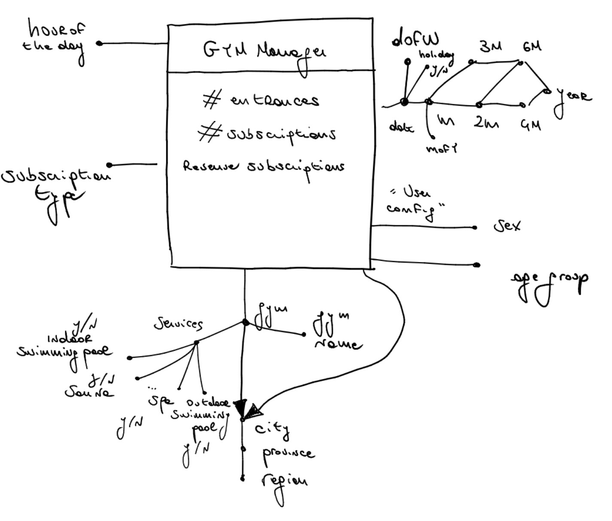
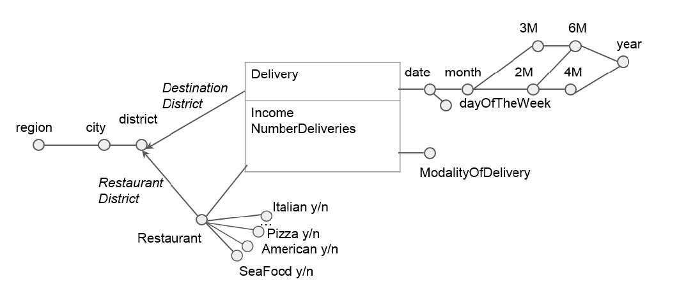
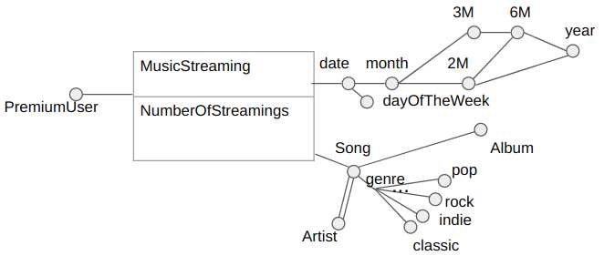
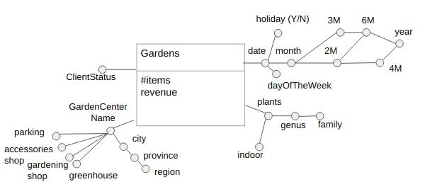
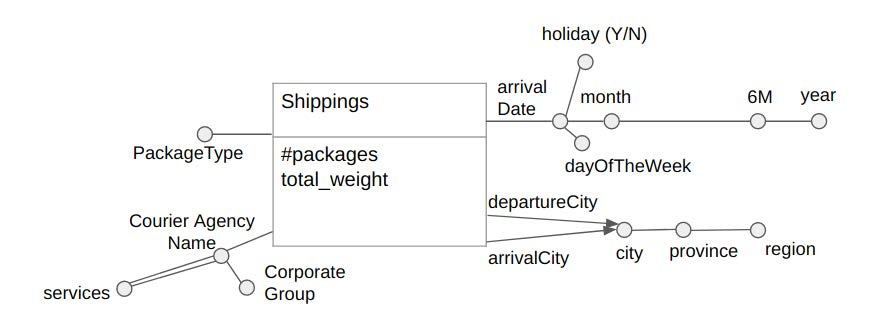
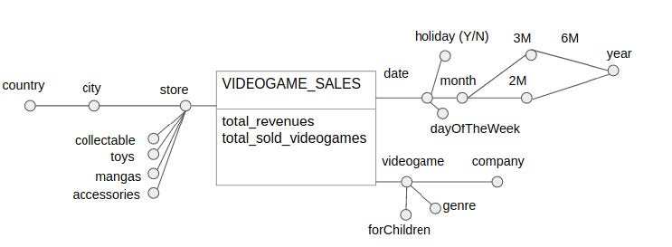
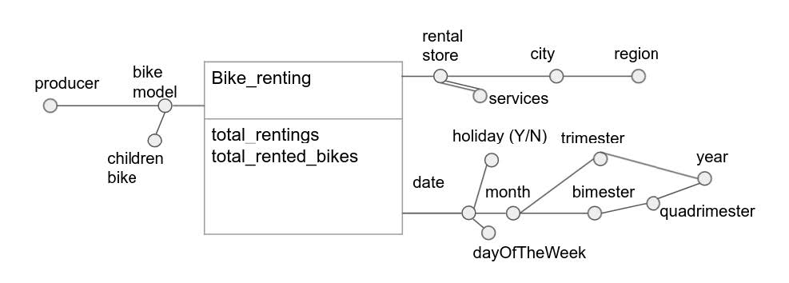
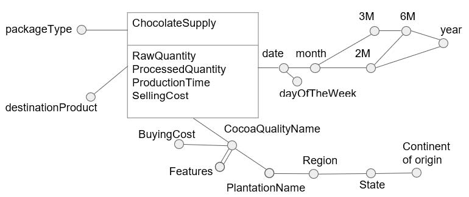

# Logical Design Exam Exercises
## February 14, 2020

Provide below the logical design of the conceptual DW schema indicated in the picture.
```
GymManager(UserLocationID, TimeID, HourID, GymID, SubscriptionID, numEntrances, numSubscriptions, totRevenues)
Gym(GymID, gym, LocationID, indoor_pool, outdoor_pool, spa, ..., sauna)
Time(TimeID, date, month, month_of_the_year, 2M, 3M, 4M, 6M, year, day_of_the_week, holiday)
Location(LocationID, city, province, region)
Hour(HourID, hour_of_the_day)
UserConfig(UserConfigID, age_group, sex)
Subscription(SubscriptionID, subscriptionType)
```
## June 18, 2020
Given the following conceptual schema:


- Each restaurant has a unique name and it can belong to more than one category.
- There are 10 categories of restaurants: Italian, Pizza, ..., American, SeaFood.
- The cardinality of "ModalityOfDelivery" is 3, and it can be “B” for bike, “C” for car, or “O” for other means.

Write the logical design of the conceptual DW schema indicated in the picture.
```
Delivery(TimeID, RestaurantID, DestinationDistrictID, ModalityOfDelivery, income, numberDeliveries)
District(DistrictID, district, city, region)
Restaurant(RestaurantID, restaurant, italian, pizza, ..., american, seaFood, DistrictID)
Time(TimeID, date, month, 2M, 3M, 4M, 6M, year, dayOfTheWeek)
```
## September 11, 2020
Given the following conceptual schema:


- Each song has a unique name and a song can be performed and recorded by one or more artists.
- There are 10 categories of music genres: pop, rock, indie, ..., classic.
- The cardinality of “PremiumUser” is 2, and it can be “0” for “no”, “1” for “yes”.

Write the logical design of the conceptual DW schema indicated in the picture.
```
MusicStreaming(SongID, TimeID, PremiumUser, numberOfStreamings)
Time(TimeID, date, month, 2M, 3M, 6M, year, dayOfTheWeek)
Song(SongID, song, album, pop, rock, indie, ..., classic)
Artist(ArtistID, artist)
Performance(SongID, ArtistID)
```
## February 01, 2021
Given the following conceptual schema:


- Each garden center has a unique name. A garden center can have 0 or more services. There are 4 available services: “parking”, “accessories shop”, “gardening shop” and “greenhouse”.
- The cardinality of “ClientStatus” is 3, and it can be “1” for “Silver”, “2” for “Gold” and “3” for “Platinum”.
- A plant can be either an indoor or an outdoor plant. The genus and family of the plant are stored.

Write the logical design of the conceptual DW schema indicated in the picture.
```
Gardens(GardenCenterID, TimeID, PlantID, ClientStatus, numberOfItems, revenue)
Time(TimeID, date, month, 2M, 3M, 6M, year, dayOfTheWeek, holiday)
Plants(PlantID, plant, genus, family, indoor)
GardenCenter(GardenCenterID, gardenCenter, city, province, region, parking, accessories_shop, gardening_shop, greenhouse)
```
## February 15, 2021
Given the following conceptual schema:


- For each shipping, the departure and arrival cities, provinces and regions are recorded.
- The cardinality of “PackageType” is 3, and it can be “1” for “Small”, “2” for “Medium” and “3” for “Large”.
- For the shipping, the courier agency is recorded. The courier agency has a unique name. Each agency belongs to a Corporate group.
- An agency may have some additional services available. Examples of additional services are “package tracking”, “package insurance” and “notification by SMS”. The systems records which services are available for each agency. The number of possible additional services is large and growing, hence the full list is not known a prior.
- The system stores the arrival date, the day of the week and if the day was an holiday or not. It also stores the month, year and semester.

Write the logical design of the conceptual DW schema indicated in the picture.
```
Shippings(CourierAgencyID, TimeID, departureLocationID, arrivalLocationID, PackageType, numOfPackages, totalWeight)
CourierAgency(CourierAgencyID, courierAgency, corporateGroup)
Service(ServiceID, service)
ServiceAvailable(CourierAgencyID, ServiceID)
Location(LocationID, city, province, region)
Time(TimeID, date, month, 6M, year, dayOfTheWeek, holiday)
```
## June 17, 2021
Given the following conceptual schema:


- A video game has a unique name and it is distributed by a video game company.
- Each video game has a specific genre.
- A videogame can be appropriate for children or not.
  - The value of this field can be “0” for not appropriate and “1” for appropriate.
- A store is identified by a unique name. Stores are analyzed according to their city and country.
- Each store may sell some additional articles. There are 4 possible types of additional articles: “collectable”, “toys”, “manga” and “accessories”.
- The system records the sales with their date, the day of the week and if the day was an holiday or not. It also records the month, year, bimester, trimester and semester of the sales.

Write the logical design of the conceptual DW schema indicated in the picture.
```
VideoGameSales(StoreID, VideoGameID, TimeID, total_revenues, total_sold_videogames)
Store(StoreID, store, city, country, collectable, toys, manga, accessories)
VideoGame(VideoGameID, videogame, company, genre, forChildren)
Time(TimeID, date, month, 2M, 3M, 6M, year, dayOfTheWeek, holiday)
```
## September 01, 2021
Given the following conceptual schema:


- The system stores the bike model and its producer. A bike model can be a model for children or not (field “children bike”). The value of this field can be “1” if the bike is for children and “0” if not.
- A rental store is identified by a unique name. Stores are analyzed according to their city and region.
- Each rental store may offer many additional articles. Examples of additional services are “bar”, “restaurant”, “wi-fi”, “bike insurance”.
- The system records the renting with their date, the day of the week and if the day was an holiday or not. It also records the month, year, bimester, trimester and quadrimester of the rentings.

Write the logical design of the conceptual DW schema indicated in the picture.
```
BikeRenting(BikeModelID, TimeID, StoreID, total_rentings, total_rented_bikes)
Model(BikeModelID, bike_model, producer, children_bike)
Time(TimeID, date, month, 2M, 3M, 4M, year, dayOfTheWeek, holiday)
Store(StoreID, store, city, region)
Service(ServiceID, service)
AdditionalService(StoreID, ServiceID)
```
## January 28, 2022
Given the following conceptual schema:


- Each cocoa quality has a unique name and can have one or more features.
- The system stores the final type of product in the destinationProduct field (i.e. darkchocolate, cinnamon-flavoured, etc.).
- PackageType has a cardinality of 2. The system stores with the integer 0 the bartypes and with 1 the truffle package type.

Write the logical design of the conceptual DW schema indicated in the picture.
```
ChocolateSupply(CocoaQualityID, TimeID, packageType, destinationProduct, raw_quantity, processed_quantity, production_time, selling_cost)
CocoaQuality(CocoaQualityID, cocoa_quality, buying_cost, plantation, region, state, continent)
CocoaFeature(CocoaQualityID, Feature)
Time(TimeID, date, month, 2M, 3M, 6M, year, dayOfTheWeek)
```
